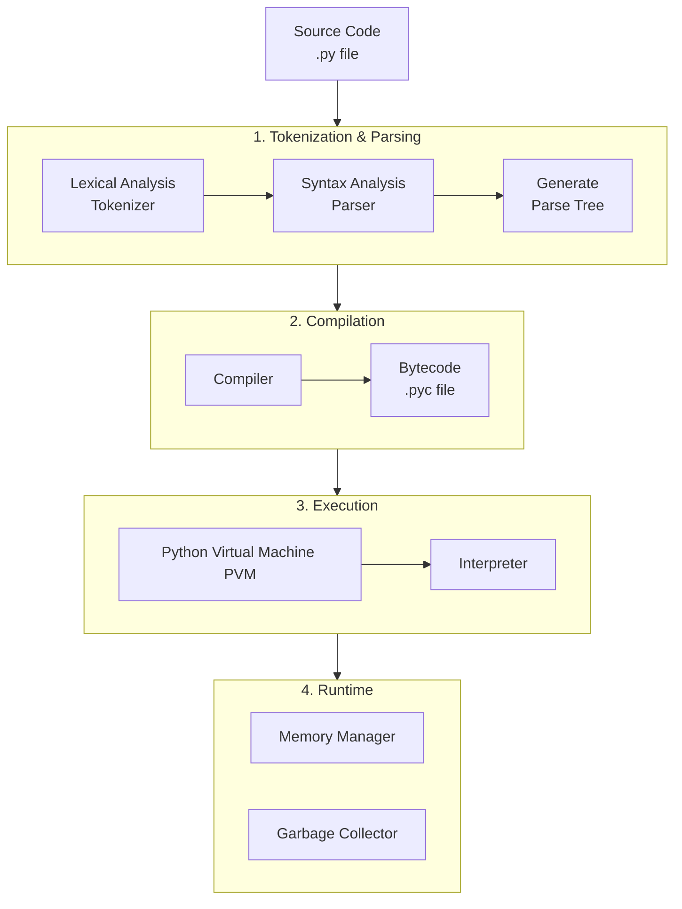

Understanding how the Python interpreter works gives you deep insight into why Python behaves the way it does. Let's break it down.

At its core, the Python interpreter is a **virtual machine** that executes a set of instructions. Its job is to take your human-readable source code (.py file) and translate it into actions your computer's CPU can perform.

The process can be summarized in four key stages:
1.  **Tokenization & Parsing**
2.  **Compilation to Bytecode**
3.  **Execution in the Python Virtual Machine (PVM)**
4.  **Runtime Management (Memory & Garbage Collection)**

Here’s a visual overview of this process:



---

### 1. Tokenization & Parsing (The "Decoding" Phase)

When you run `python script.py`, the interpreter first reads your source code.

Of course. Here is a combined and streamlined summary that integrates your points with my explanations.

***

### How the Python Interpreter Understands Your Code: Tokenization & Parsing

Before any code can be executed, the Python interpreter must first decode and validate your source code. This initial "decoding" phase happens in two critical steps: **Tokenization** and **Parsing**.

#### 1. Tokenization (Lexical Analysis): Breaking the Code into "Words"

Think of this step as the interpreter reading your code line-by-line and breaking it down into its smallest, meaningful building blocks, called **tokens**. It's like splitting a sentence into individual words and punctuation.

*   **What Happens:** The interpreter scans the raw text of your script and categorizes every character. For the line of code `result = 10 + 5`, the tokenizer doesn't see a sentence; it identifies five distinct tokens:
    *   `result` (an identifier/variable name)
    *   `=` (an operator)
    *   `10` (a number literal)
    *   `+` (an operator)
    *   `5` (a number literal)

*   **Purpose:** This process identifies all keywords (like `if`, `def`), operators (like `+`, `=`), identifiers (variable names), and literals (numbers, strings). It catches simple, low-level errors like an unmatched parenthesis or an invalid character that doesn't belong in the Python language.

#### 2. Parsing (Syntax Analysis): Checking the "Grammar"

Once the code is broken into tokens, the next step is to see if these tokens form a valid, logical structure according to Python's **grammar rules**. It's no longer about the individual words, but about whether the sentence they form makes sense.

*   **What Happens:** The parser takes the stream of tokens and checks their order and relationship against Python's strict syntax rules. It confirms that the sequence `[Variable] = [Number] + [Number]` is a valid assignment statement.

*   **The Output - Abstract Syntax Tree (AST):** If the tokens are in a valid order, the parser builds an **Abstract Syntax Tree (AST)**, which is a tree-like representation of your code's structure. The AST is not a list of tokens; it's a structured diagram that encapsulates the logic: *"Assign the value of the expression (10 + 5) to the variable 'result'."*

*   **Error Checking:** This step catches all grammatical errors. It ensures there's a colon after an `if` statement, that indentation is correct, and that operators have the correct number of operands. If the rules are broken—for example, by writing `10 = result +`—the parser raises a **`SyntaxError`** and stops the process immediately.

### Why This Matters

This two-step process is the compiler's essential first check. **Tokenization** verifies that all the "words" in your code are valid. **Parsing** verifies that you've put those words together into a valid "sentence." Only after your code passes both of these checks will it be compiled into bytecode and executed. This ensures that the interpreter only tries to run code that is syntactically correct.
---

### 2. Compilation to Bytecode

This is where a major misconception is cleared up: **Python is a compiled language.** But it doesn't compile to machine code; it compiles to an intermediate language.

*   The compiler takes the AST and generates **bytecode**. Bytecode is a set of simple, platform-independent instructions for a theoretical computer. It's much lower level than your source code but not as low-level as native machine code (which runs directly on your CPU).
*   This bytecode is stored in `.pyc` files (in a `__pycache__` directory) to speed up subsequent executions. If you run your script again and don't change the source code, Python can skip the parsing and compilation steps and load the pre-compiled bytecode directly. This is why the second run of a program is often slightly faster.

You can see the bytecode for any function using the `dis` module:
```python
import dis

def greet(name):
    print(f"Hello, {name}")

dis.dis(greet)
```
**Output (simplified):**
```
2           0 LOAD_GLOBAL              0 (print)
            2 LOAD_CONST               1 ('Hello, ')
            4 LOAD_FAST                0 (name)
            6 FORMAT_VALUE             0
            8 BUILD_STRING             2
           10 CALL_FUNCTION            1
           12 POP_TOP
           14 LOAD_CONST               0 (None)
           16 RETURN_VALUE
```
These are the instructions the Python Virtual Machine will execute.

---

### 3. Execution: The Python Virtual Machine (PVM)

This is the heart of the interpreter. The PVM is a **stack-based virtual machine**.

*   It's not a physical piece of hardware but a program that reads the bytecode instructions one by one and executes them.
*   It's **stack-based** because most operations involve pushing values onto an internal stack and then popping them off to perform operations (like addition).
*   The PVM is the "interpreter" in the classic sense. It's the component that actually *runs* your code.
*   This is also where **dynamic typing** happens. The PVM only checks the type of an object when an instruction is being executed. For example, the `+` instruction will work if the objects are numbers (addition) or strings (concatenation). If they aren't, it will raise a `TypeError` at this exact moment.

**The most common PVM implementation is `CPython`** (written in C). This is the standard and most widely used Python interpreter. When people say "Python," they usually mean CPython.

---

### 4. Runtime Management: Memory and the Garbage Collector

While the PVM is executing bytecode, other subsystems are constantly working:

*   **Memory Management:** The interpreter handles memory allocation for all objects (integers, lists, your custom class instances, etc.) in a private heap. You never have to manually allocate or free memory like in C/C++.
*   **Garbage Collection (GC):** Python uses a combination of two mechanisms to reclaim memory from objects that are no longer in use:
    1.  **Reference Counting:** Every object has a count of how many variables (references) point to it. When this count drops to zero, the memory is immediately freed. This handles most garbage collection.
    2.  **Generational Cyclic Garbage Collector (GC module):** This handles a tricky case: **reference cycles**. This is when two objects reference each other (e.g., `objA.ref = objB` and `objB.ref = objA`), so their reference counts never hit zero, even if they are no longer accessible by your code. The GC finds and breaks these cycles, freeing the memory.

---

### Key Takeaways & Implications

1.  **"Interpreted" is a Simplification:** Python is both compiled and interpreted. The compilation step (to bytecode) is hidden from the user.
2.  **Platform Independence:** Python bytecode is platform-independent. The same `.pyc` file can be run on any operating system, as long as it has the appropriate PVM (e.g., the Windows version of Python or the Linux version). This is the "Write Once, Run Anywhere" principle, similar to Java.
3.  **It's Slower Than Native Code:** The PVM adds a layer of abstraction. Instead of running directly on the CPU, instructions are interpreted by a software program (the PVM). This is the primary reason Python is generally slower than compiled languages like C or Rust, which are compiled directly to native machine code.
4.  **There Are Other "Pythons":** The PVM doesn't have to be written in C.
    *   **Jython:** Compiles Python to Java bytecode to run on the Java Virtual Machine (JVM).
    *   **IronPython:** Compiles Python to run on the .NET Common Language Runtime (CLR).
    *   **PyPy:** A JIT (Just-In-Time) compiler for Python. It interprets the code at first but identifies hot spots (often-used loops) and compiles them into fast native machine code on the fly, often making it much faster than CPython.