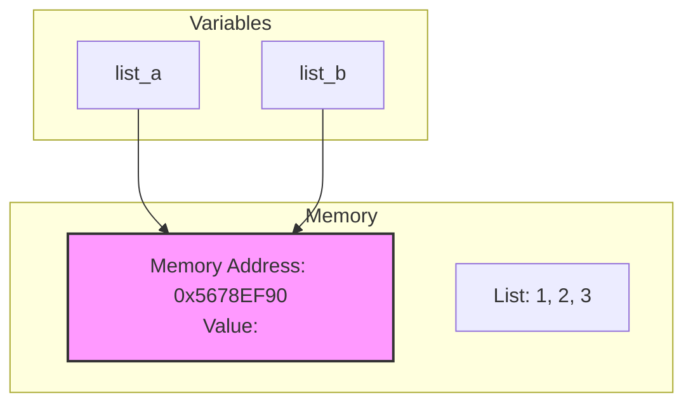

# Variables in Python

Variables are fundamental building blocks in Python programming. They act as named containers that store data values in memory.

## What is a Variable?

A variable is a symbolic name that refers to a value stored in computer memory. Think of it as a labeled box where you can store information.

```python
# Simple variable assignment
name = "Alice"
age = 25
height = 5.8
is_student = True
```

## Variable Naming Rules

Python has specific rules for naming variables:

- Must start with a letter (a-z, A-Z) or underscore (_)
- Can contain letters, numbers, and underscores
- Cannot contain spaces or special characters
- Are case-sensitive (`age` ≠ `Age` ≠ `AGE`)
- Cannot use Python keywords (reserved words)

```python
# Valid variable names
first_name = "John"
_last_name = "Doe"
age2 = 30
MAX_VALUE = 100

# Invalid variable names
2nd_name = "Smith"  # Cannot start with number
my-variable = 10    # Cannot use hyphens
class = "Math"      # Cannot use keyword
```

## Variable Assignment

### Single Assignment
```python
x = 10
message = "Hello, World!"
```

### Multiple Assignment
```python
# Assign multiple variables in one line
a, b, c = 1, 2, 3

# Assign same value to multiple variables
x = y = z = 0
```

## Dynamic Typing

Python is dynamically typed, meaning you don't need to declare variable types explicitly:

```python
# Variable can change type
var = 10        # Now it's an integer
print(type(var))  # <class 'int'>

var = "Hello"   # Now it's a string
print(type(var))  # <class 'str'>

var = 3.14      # Now it's a float
print(type(var))  # <class 'float'>
```

## Data Types in Variables

Variables can hold different data types:

```python
# Integer
count = 10

# Float
price = 19.99

# String
name = "Alice"

# Boolean
is_active = True

# List
numbers = [1, 2, 3, 4, 5]

# Tuple
coordinates = (10, 20)

# Dictionary
person = {"name": "Bob", "age": 25}

# Set
unique_numbers = {1, 2, 3, 4}
```

## Variable Scope

Variables have different scopes depending on where they're defined:

### Global Scope
```python
global_var = "I'm global"

def my_function():
    print(global_var)  # Accessible

my_function()
```

### Local Scope
```python
def my_function():
    local_var = "I'm local"
    print(local_var)  # Accessible

my_function()
# print(local_var)  # Error: not accessible outside function
```

### Using `global` keyword
```python
x = 10

def modify_global():
    global x
    x = 20

modify_global()
print(x)  # Output: 20
```

## Best Practices

1. **Use descriptive names**: `student_count` instead of `sc`
2. **Follow naming conventions**:
   - snake_case for variables and functions
   - UPPERCASE for constants
   - CamelCase for classes

```python
# Good practices
student_count = 100
MAX_STUDENTS = 150
class StudentRecord: pass

# Avoid
sc = 100  # Not descriptive
```

3. **Initialize variables before use**
4. **Avoid using built-in function names as variables**

## Memory Management

Python handles memory management automatically:
- Variables are references to objects
- Memory is allocated when variables are created
- Garbage collection frees memory when variables are no longer referenced

```python
# Both variables point to the same object
a = [1, 2, 3]
b = a
b.append(4)
print(a)  # [1, 2, 3, 4] - both variables affected

# Create a copy to avoid this
c = a.copy()
c.append(5)
print(a)  # [1, 2, 3, 4] - original unchanged
```

## Type Hints (Python 3.5+)

While Python is dynamically typed, you can add type hints for better code clarity:

```python
def greet(name: str, age: int) -> str:
    return f"Hello {name}, you are {age} years old"

# Variables with type hints
count: int = 10
price: float = 19.99
names: list[str] = ["Alice", "Bob"]
```

### What This Looks Like in Code & Memory


**Step 1: Assignment**
```python
answer = 42
```
This single line of code does three things:
1.  **Creates the object:** The Python interpreter creates an integer object with the value `42`.
2.  **Allocates memory:** It finds an empty space in your computer's RAM to store this object. Let's pretend the memory address is `0x1234ABCD`.
3.  **Binds the name:** It creates the variable name `answer` and makes it **point to** or **refer to** the memory address `0x1234ABCD`.

The resulting mental model looks like this:

| Variable (The Label) | Memory Address (The Box Location) | Value (The Content) |
| :------------------- | :-------------------------------- | :------------------ |
| `answer`             | `0x1234ABCD`                      | `42`                |

**Step 2: Using the Variable**
```python
print(answer) # Output: 42
result = answer + 10 # result becomes 52
```
*   When you use `answer` in an expression, Python doesn't see the name "answer". It sees the name and immediately looks up what it *refers to*.
*   It follows the "pointer" from the variable `answer` to the memory address `0x1234ABCD`.
*   It retrieves the value `42` from that location.
*   It then uses the *value* (`42`) in the operation (`42 + 10`).

### The Crucial Insight: Variables are References, not Containers

A common misconception is to think of a variable *as* the box itself. It's more accurate to think of it as a **name tag** or a **reference** tied to the box.

This becomes critically important with complex data types like lists.

```python
list_a = [1, 2, 3] # 1. Create a list object in memory
list_b = list_a     # 2. Make 'list_b' refer to the SAME object

list_a.append(4)    # 3. Modify the object through 'list_a'

print(list_a) # Output: [1, 2, 3, 4]
print(list_b) # Output: [1, 2, 3, 4] (Wait, why did list_b change?!)
```

**Why did `list_b` change?** Because both variable names (`list_a` and `list_b`) are just labels pointing to the *exact same box* (the same memory address). You didn't create a new list; you just put a second label on the same existing list.

This visual explains it:



To actually create a separate, independent copy, you need to explicitly tell Python to create a new box (a new object) and put the same contents inside it.

```python
list_a = [1, 2, 3]
list_b = list_a.copy() # or list_b = list_a[:]

list_a.append(4)

print(list_a) # Output: [1, 2, 3, 4]
print(list_b) # Output: [1, 2, 3] (Now it's independent)
```

### Summary: Key Takeaways

*   **Symbolic Name:** The variable name (`answer`, `list_a`) is a convenient, human-friendly symbol for the programmer to use. The computer doesn't need it; it uses memory addresses.
*   **Refers to / Points to:** A variable is not the value itself. It is a **reference** to the location in memory where the value is stored.
*   **Stored in Memory:** The actual data (the integer `42`, the list `[1, 2, 3]`) exists as an object at a specific physical location in your computer's RAM.
*   **The Assignment Operator (`=`):** This operator **binds** a name to a value. It does not "copy" the value into the variable. It creates a reference from the name to the object.

